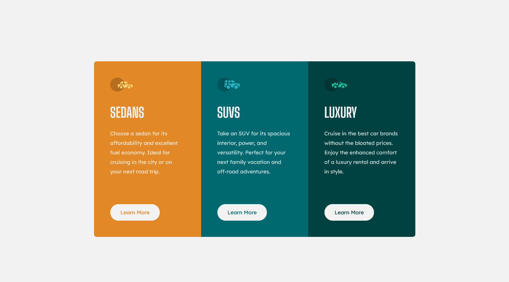

# Frontend Mentor - 3-column preview card component solution

This is a solution to the [3-column preview card component challenge on Frontend Mentor](https://www.frontendmentor.io/challenges/3column-preview-card-component-pH92eAR2-). Frontend Mentor challenges help you improve your coding skills by building realistic projects. 

## Table of contents

- [Overview](#overview)
  - [The challenge](#the-challenge)
  - [Screenshot](#screenshot)
  - [Links](#links)
- [My process](#my-process)
  - [Built with](#built-with)
  - [What I learned](#what-i-learned)
  - [Continued development](#continued-development)
  - [Useful resources](#useful-resources)
- [Author](#author)
- [Acknowledgments](#acknowledgments)

## Overview

### The challenge

Users should be able to:

- View the optimal layout depending on their device's screen size
- See hover states for interactive elements

### Screenshot



### Links

- [Solution](https://www.frontendmentor.io/solutions/3column-preview-card-tailwindcss-vanilla-js-rPQutQSZgO)
- [Live Site](https://your-live-site-url.com)

## My process

### Built with

- Semantic HTML5 markup
- CSS custom properties
- Flexbox
- Mobile-first workflow
- Vanilla JS
- [TailwindCSS](https://tailwindcss.com/) - CSS Utility Framework

### What I learned

When I first read the challenge name, the `columns` CSS shorthand property 
popped into my head. Unfortunately, that didn't account for responsive design. 
The next thing I thought about was Flexbox, which did work.

Another challenge I came across was maintaining styles for all 3 cards. Any 
change to the card's structure or styling meant I would have to find and 
change all 3 of them. This is one of the several main issues with code 
duplication.

My solution was to separate card creation into a JS function. Then, I could 
call that function 3 times when the page loads. For each card, I could pass 
in different content and primary colors as arguments. I decided to take a 
more functional approach, opting for pure functions and nesting them to 
reduce duplicate parameters.

While I could've used a JS frontend framework like ReactJS so that my code 
would be more organized, I also wanted to familiarize myself with the 
`Document` Web API and to experience working with the low-level vanilla JS 
over higher-level frameworks.

I also started paying more attention to HTML semantics. For example, I used 
replaced my "Learn More" `<button>` with `<a>` to denote a link. That would 
make more sense, since a user who would click on it should be directed to a 
separate page containing more info.

### Continued development

One of the challenges I faced when using TailwindCSS + vanilla JS was using 
Tailwind's classes. I discovered that I can't concatenate strings containing 
only a portion of the TailwindCSS class name. I had to use strings that 
contained the entire class name, otherwise TailwindCSS cannot read it.

For example, TailwindCSS won't add the background color styling on `article` 
dynamically:

```js
function makeCard(carType, summary, primaryColor) {
  // ...

  const card = document.createElement('article');
  
  // TailwindCSS cannot read the first class name
  card.className = `bg-${primaryColor} ...`;
  
  return card;

  // ...
}
```

However, this works:

```js
function makeCard(carType, summary) {
  // ...

  const card = document.createElement('article');
  
  // TailwindCSS class name is defined statically
  const backgroundColor = 'bg-bright-orange';

  // TailwindCSS will read the first class name (along w/ all the others)
  card.className = `${backgroundColor} ...`;
  
  return card;

  // ...
}
```

But passing that would mean passing in a new string for the background color, 
the link text color, and the link background color on hover as arguments, as 
opposed to the shared color itself. TailwindCSS recommends storing the full 
class name strings into JS objects, like so:

```js
function makeCard(carType, summary, primaryColor) {
  const colorVariants = {
    background: {
      brightOrange: 'bg-bright-orange',
      darkCyan: 'bg-dark-cyan',
      veryDarkCyan: 'bg-very-dark-cyan',
    },
    text: {
      brightOrange: 'text-bright-orange',
      darkCyan: 'text-dark-cyan',
      veryDarkCyan: 'text-very-dark-cyan',
    },
    hover: {
      background: {
        brightOrange: 'hover:bg-bright-orange',
        darkCyan: 'hover:bg-dark-cyan',
        veryDarkCyan: 'hover:bg-very-dark-cyan',
      },
    },
  };

  const card = document.createElement('article');
  card.className = `${colorVariants.background[primaryColor]} ...`;
  
  return card;

  // ...
}
```

While it works, maintaining said object can bring its own issues. What if I 
wanted to accept new primary colors? I have to add a new color under each 
property that I'm styling. What if I wanted to customize more CSS properties 
or add more styling on certain states or screen sizes? I have to add more 
nested objects, containing all of the colors I have so far. Granted, such 
maintenance issues aren't relevant to the challenge. However, I can also see 
that becoming a bigger issue on projects where that level of customization may 
be needed. In the future, I might just leave it to the JS instead of the CSS 
to handle that level of customization.

### Useful resources

- [px vs rem](https://stackoverflow.com/a/43131958) - This helped me understand why frontend developers use `rem` units in general. I also learned that it's not a good idea to set the root font size using `px`, but instead to use percentages to change the apparent root font size.

## Author

- Frontend Mentor - [@StephenYu2018](https://www.frontendmentor.io/profile/yourusername)
